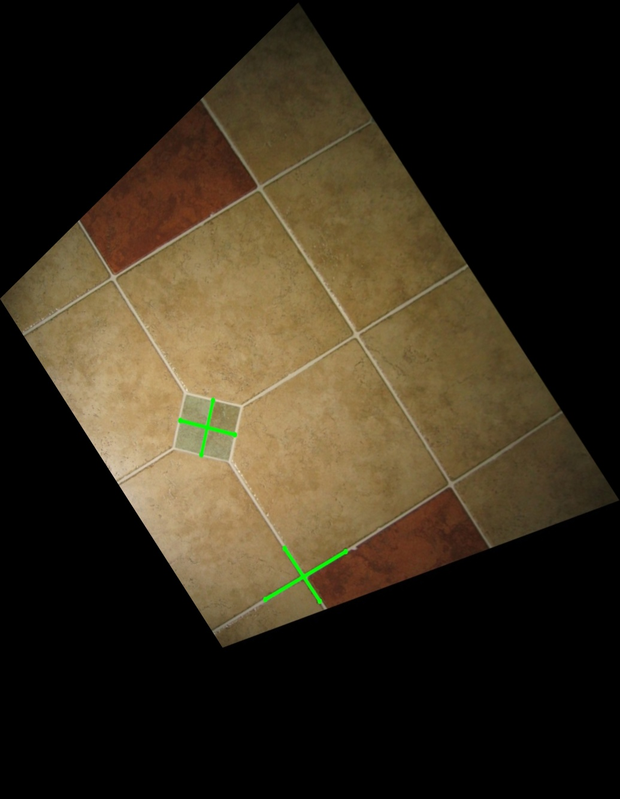

# Projective Geometry and Homography

We will implement:
1. Simple image rectification algorithm given a single image. We leverage the mental model that humans have of the 3D world and how straight 
   lines in 3D project on to images. 
2. Homography estimation between two images via interactively marking point correspondences. We will show a simple AR application of such an 
   estimation.

## Affine Rectification 
The goal here is to generate affinely correct warps for images that are captured through perspective cameras (assuming pinhole camera 
model), with annotations of at least 2 pairs of parallel lines.

**Dataset Preparation:**

We find images that have sufficient perspective and planar surfaces with atleast 2 identifiable pairs of parallel lines. 

Here's an example:

 | Good Input  |                 Bad Input                 |
 |:-----------------------------------------:| :---------: |
 |    |   |

**Method:**

1. Annotate 2 pairs of identifiable parallel  (in the real 3D world) lines - $l1$ and $l2$. The equation of each line comes from the cross 
   product of two 
   distinct points on it. 
2. The input image has a perspective transform and therefore the projection of real world pair of parallel lines intersect at a finite point. This 
   point can be written as $l_1 \times l_2$
   for each pair of lines. 
3. The points two points of intersection $p1$ and $p2$ lie on a line $l'_{\infty} = p_1 \times p_2$. This constitutes the projection of the line at 
   infinity $l
   {\infty} = [0, 0, 1]$. 
4. We can now define a homography $H$ between the original line at infinity and its projection by $l_{\infty} = H ^{-T} l'{\infty}$. 
5. Solving the above equation we arrive at the solution $ H = [[1, 0, 0], [0, 1, 0], [l1, l2, l3]]$ where $l'_{\infty} = l1, l2, l3$.

**Command:**

Place you images under `data/rectification` as a `.jpg` images. 
```
python main.py --type rectification --method affine --imgs "list of image names"
```
**Results:**

|       Input Image        |  Annotated Parallel Lines on Input  |   Affine-Rectified Output   |
|:------------------------:|:-----------------------------------:|:---------------------------:|
|   |   |   |
|   |   |   |
|   |   |   |
|  |  |  |
|      |      |      |

We evaluate angles (more precisely, the cosines) of 2 pairs of parallel lines before and after rectification. This will show how close to correct the final affine rectification is.

| Before rectification | After Rectification | Angles (Before) | Angles (After) |
|----------------------| -----------  |-----------------|----------------|
||| 0.9805              | 0.9999         |
||| 0.9999              | 1.0000         |
||| 0.9999               | 0.9999         |
||| 0.9836               | 1.0000         |
||| 0.9995               | 1.0000         |
||| 0.9997               | 1.0000         |
||| 0.9990               | 1.0000        |
||| 1.0000              | 1.0000        |
||| 0.9997               | 1.0000       |
||| 0.9997              |  1.0000        |

## Metric Rectification

The goal here is to generate metrically correct warps for images that are captured through perspective cameras (assume pinhole camera 
model), with annotations of at least 2 pairs of perpendicular lines and affine rectified image obtained in the previous section.

**Dataset Preparation:**

We find images that have sufficient perspective and planar surfaces with atleast 2 identifiable pairs of parallel lines and 2 pairs of 
perpendicular lines. 

**Method:**

1. Given an affine-rectified image, annotate 2 pairs of lines which we know to be perpendicular in the real-world (ideally which lead to different 
constraints).
2. For one such pair of lines $$l'$$ and $$m'$$, we know that $$l' C^{*'}_{\infty} m' = 0$$. For an affine-rectified image, this has 3 variables.
3. By rearranging the terms, create a system of linear equations of the form $$Ac = 0$$ and solve for $$c$$ using SVD.
4. We know that $$C^{'}_{\infty} = H C^{'}{\infty} H^T$$. Using SVD, $$C^{*'}{\infty} = U \Sigma U^T$$ and therefore, $$H = \begin{bmatrix} \sqrt
   {\sigma_{1}^{-1}} & 0 & 0 \ 0 & \sqrt{\sigma_{2}^{-1}} & 0\ 0 & 0 & 1 \end{bmatrix} U^T$$

**Command:**
Place you images under `data/rectification` as a `.jpg` images. 
```
python main.py --type rectification --method affine_to_metric  --imgs "list of image names"
```
**Results:**

| Input Image | Annotated perpendicular lines on input image | Annotated perpendicular lines on Affine-Rectified Image |               Metric-Rectified Image               |
|:------------------------:|:-----------------------------------:|:---------------------------:|:----------------------------------------------:|
|   |   |   |     |
|   |   |   |     |
|   |   |   |     |
|  |  |  |    |
|     |     |     |        |

We evaluate angles (more precisely, the cosines) of 2 pairs of perpendicular lines before and after rectification. This will show how close to 
correct the final affine rectification is.


| Before rectification                           | After Rectification | Angles (Before) | Angles (After) |
|------------------------------------------------| -----------  |-----------------|----------------|
|   || 0.3553          | -0.01785       |
|   || 0.3442          | -0.0462        |
|   || 0.0574          | -0.0414        |
|   || -0.2445         | -0.0502        |
|   ||  0.0202        | -0.0245       |
|   || 0.0235         | -0.0197        |
|  || 0.6254       | -0.0392       |
|  || 0.6382          | -0.0284        |
|      || -0.1035         | -0.0039        |
|      || -0.1021        | -0.0036        |

## Planar Homography from Point Correspondences

Our goal here is to estimate the homography between two images using point correspondences. The point correspondences are marked interactively. 

**Method:**

1. Establish 4 point correspondences $$(x_i, x_i')$$ between the 2 images. The homography $$H$$ will be such that (upto a scale) $$x_i' = Hx_i$$
2. Therefore, we can solve this system of equations using the fact $$x_i' \times Hx_i = 0$$.
3. For each correspondence, this results in 2 constraints of the form: $$\begin{bmatrix} \mathbf{0} & -w'\mathbf{x}^T & y'\mathbf{x}^T \ w'\mathbf{x}
   ^T & \mathbf{0} & -x'\mathbf{x}^T \end{bmatrix}h = 0$$
4. Use SVD to find h (elements of H).

**Command:**
Place you images and template image under `data/homography` as a `.jpg` images. 
```
python main.py --type homography --imgs "list of images" --template "template image name" --outname "output image name"
```
**Results:**

| Normal Image                       |            Perspective Image            | Annotated corners in Perspective Image |        Warped and Overlaid Image         |
|:-----------------------------------|:---------------------------------------:|:---------------------------------:|:----------------------------------------:|
|  |  |       |   |
|      |          |       |   |


## Direct Metric Rectification

We now metric-rectify the image directly from at least 5 pairs of perpendicular lines. More than 5 pairs can yield 
more accurate results.

**Dataset Preparation:**

We find images that have sufficient perspective and planar surfaces with atleast 5 identifiable pairs of perpendicular lines. 

**Method:**

1. Given an image, annotate 5 pairs of lines which we know to be perpendicular in the real-world (ideally which lead to different constraints).
2. For one such pair of lines $$l'$$ and $$m'$$, we know that $$l' C^{*'}_{\infty} m' = 0$$. For a random image, this has 6 variables.
3. By rearranging the terms, create a system of linear equations of the form $$Ac = 0$$ and solve for $$c$$ using SVD.
4. We know that $$C^{'}_{\infty} = H C^{'}{\infty} H^T$$. Using SVD, $$C^{*'}{\infty}
   = U \Sigma U^T$$ and therefore, $$H = \begin{bmatrix} \sqrt
   {\sigma_{1}^{-1}} & 0 & 0 \ 0 & \sqrt{\sigma_{2}^{-1}} & 0\ 0 & 0 & 1 \end{bmatrix} U^T$$


**Command:**
Place you images under `data/rectification` as a `.jpg` images. 
```
python main.py --type rectification --method direct_metric --imgs "list of image names"
```

**Results:**

| Input Image | Annotated perpendicular lines on input image | Annotated perpendicular lines on Affine-Rectified Image |               Metric-Rectified Image               |
|:------------------------:|:-----------------------------------:|:---------------------------:|:----------------------------------------------:|
|   |   |   |     |
|   |   |   |     |
|   |   |   |     |
|  |  |  |    |
|     |     |     |        |

We evaluate angles (more precisely, the cosines) of 2 pairs of perpendicular lines before and after rectification. This will show how close to 
correct the final affine rectification is.


| Before rectification                           | After Rectification | Angles (Before) | Angles (After) |
|------------------------------------------------| -----------  |-----------------|----------------|
|   || 0.3553          | -0.01785       |
|   || 0.3442          | -0.0462        |
|   || 0.0574          | -0.0414        |
|   || -0.2445         | -0.0502        |
|   ||  0.0202        | -0.0245       |
|   || 0.0235         | -0.0197        |
|  || 0.6254       | -0.0392       |
|  || 0.6382          | -0.0284        |
|      || -0.1035         | -0.0039        |
|      || -0.1021        | -0.0036        |


## Homography with Multiple Images
Here we overlay 3 normal images on top of an image with perspective effect.

**Method**
The method is same as described under Planar Homography from Point Correspondences section.

**Command:**
Place you images and template image under `data/homography` as a `.jpg` images. 
```
python main.py --type homography --imgs "list of images" --template "template image name" --outname "output image name"
```

**Results:**

|                                     Normal Image 1                                     |        Normal Image 2        |                  Normal Image 3                   |                Perspective Image                 | Annotated corners in Perspective Image |        Warped and Overlaid Image         |
|:--------------------------------------------------------------------------------------:|:----------------------------:|:-------------------------------------------------:|:------------------------------------------------:|:---------------------------------:|:----------------------------------------:|
|                                                            |  |                 |                      |  |  |

